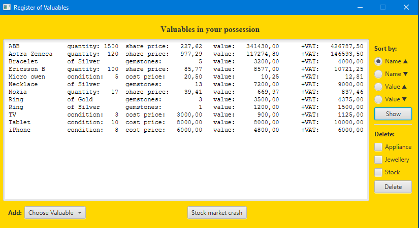

# Valuableregister
Assignment 1 for Prog2 in Java OOP at Department of Computer and Systems Sciences (DSV), Stockholm University

A small Java OOP assignment using JavaFX to register different kinds of valuables and displaying them in a sorted order. 
The <i>Valuable</i> class must be abstract and extended by the classes <i>Appliance</i>, <i>Stock</i>, <i>Jewellery</i> implementing their own <code>getValue()</code> and <code>toString()</code>. These 3 types of valuables should be added to the register thrugh a separate dialogbox. Also there should be the possibility to cause a stock market crash whereby nullifying the current value of all stock shares by setting their rate to 0, not affecting any subsequent stocks added.

Added extra functionality beyond the requirements for practice purposes:
<ul>
<li>tooltip support added</li>
<li>displaying all items in a tabular fashion</li>
<li>sorting by name in ascending and descending order</li>
<li>sorting by value in ascending and descending order</li>
<li>deleting all valuable items of a certain type</li>
</ul>
 

  
<i>ver 2.0 - Added deletion of items of a certain type, translated to english</i>
